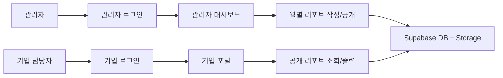
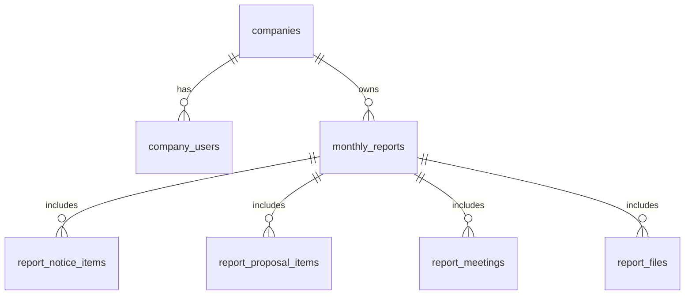

# 기업 월별 진행 리포트 구조도

## 시스템 구조

## 데이터 구조

## 테이블 요약

- `companies`: 기업 기본 정보
- `company_users`: Supabase Auth 사용자와 기업 연결
- `monthly_reports`: 월별 리포트 본문과 공개 상태
- `report_notice_items`: 맞춤 공고와 접수 상황
- `report_proposal_items`: 사업계획서 작성 수준과 컨설팅 내용
- `report_meetings`: 미팅 내용과 후속 과제
- `report_files`: Storage 파일 메타데이터

## 권한 정책

- 관리자: `admin_users`에 등록된 Auth 사용자이며 모든 기업/리포트 데이터를 조회, 생성, 수정할 수 있다.
- 기업 담당자: `company_users`에 연결된 Auth 사용자이며 자기 회사의 `published` 리포트만 조회할 수 있다.
- 파일: `report-files` 버킷에 저장하고, 관리자는 업로드/조회, 기업 담당자는 자기 회사 공개 리포트 파일 조회만 허용한다.

## 배포 메모

- SQL 적용 후 Supabase Auth에 관리자와 기업 사용자를 생성한다.
- 관리자 계정은 `admin_users`, 기업 계정은 `company_users`에 등록한다.
- `assets/supabase-config.js`에 URL, anon key, 새 테이블명과 버킷명을 설정한다.

